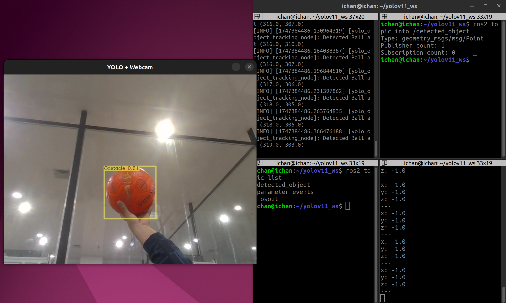

## Prerequisites

Before getting started, make sure you have installed and set up the following:

  ✅ ROS 2 (e.g., Foxy, Humble, or compatible version)

  ✅ C++17 compatible compiler (GCC 9+ or equivalent)

  ✅ OpenCV (version 4.5 or higher with contrib modules)

  ✅ ONNX Runtime (C++ API libraries and headers)

  ✅ ROS 2 dependencies: rclcpp, geometry_msgs

  ✅ Tools: cmake, colcon, and rosdep

## Model Setup

  ✅ Download a YOLOv11 ONNX model file (e.g., yolov11.onnx) from the official source or convert it from PyTorch.

  ✅ Place the .onnx file in the models/ directory:

## Verifying ONNX Runtime and Model Paths

Before running the node, please make sure that the paths to your ONNX Runtime library, YOLOv11 ONNX model file, and the coconames.txt file are correctly set and accessible.
Why is this important?

  - The program needs to load the ONNX model for inference.

  - The coconames.txt file contains the class labels for detected objects.

  - The ONNX Runtime libraries must be correctly referenced for successful execution.

How to verify paths

  - ONNX Runtime Path

  - Ensure that the ONNX Runtime shared libraries are installed and the path is correctly set in your environment or in the node parameters.

  - Model Path

  - Place your YOLOv11 ONNX model file (e.g., yolov11.onnx) inside the models/ directory of the project (or update the path accordingly).

  - Coconames Path

  - Ensure the coconames.txt file with the list of class names is located in the models/ directory (or update the path accordingly).

## Build

    # Clone the repository
    git clone https://github.com/ichsanyudika/YOLOV11-ROS2-CPP.git
    cd ~/YOLOV11-ROS2-CPP
    
    # Build the workspace
    colcon build --symlink-install
    
    # Source the workspace environment
    source install/setup.bash

## Running

    ros2 run yolo_ws main

## Result

  

