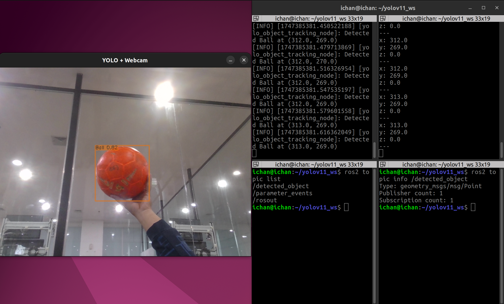

## Prerequisites

Before getting started, make sure you have installed and set up the following:

  ✅ ROS 2 (e.g., Foxy, Humble, or compatible version)

  ✅ C++17 compatible compiler (GCC 9+ or equivalent)

  ✅ OpenCV (version 4.5 or higher with contrib modules)

  ✅ ONNX Runtime (C++ API libraries and headers)

  ✅ ROS 2 dependencies: rclcpp, geometry_msgs

  ✅ Tools: cmake, colcon, and rosdep

## Model Setup

  ✅ Download a YOLOv11 ONNX model file (e.g., yolov11.onnx) from the official source or convert it from PyTorch.

  ✅ Place the .onnx file in the models/ directory:

## Build

    # Clone the repository
    git clone git clone https://github.com/ichsanyudika/yolov11-using-ros2-cpp.git
    cd ~/yolov11-ros2-cpp
    
    # Build the workspace
    colcon build --symlink-install
    
    # Source the workspace environment
    source install/setup.bash

## Running

    ros2 run yolo_ws main

## Result

  

